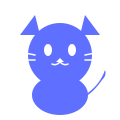
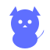

# Gatze Logo Assets

## Logo Previews

### Full Detail Logo (120x120)


**File**: `gatze-logo.svg`
- High detail version
- All facial features and whiskers
- Best for: Larger displays, marketing materials

### Simplified Logo (64x64)


**File**: `gatze-logo-simple.svg`
- Streamlined design
- Optimized for small sizes
- Best for: Favicons, mobile icons, small UI elements

## Design Elements

```
   /\  /\        ← Triangular ears (alert, attentive)
  /  \/  \
 |  o  o  |      ← Round head (friendly)
 |    ^    |     ← Simple face (approachable)
 |   \_/   |     ← Smiling mouth
  \      /
   |BODY|        ← Rounded body (soft, welcoming)
   ------
     ~           ← Curved tail (playful character)
```

## Color Specification

**Primary Color**: `#5f6fff` (Indigo)

Alternative theme colors:
- Green: `#16a34a`
- Rose: `#e11d48`
- Orange: `#ea580c`

## Usage Guidelines

### ✅ DO
- Scale proportionally
- Use on contrasting backgrounds
- Maintain clear space (minimum 8px padding)
- Use SVG format for crisp rendering
- Apply theme colors from the app's palette

### ❌ DON'T
- Stretch or distort
- Add drop shadows or effects
- Change the cat's proportions
- Use compressed/rasterized versions
- Modify the facial features

## Integration

The logo is integrated into the Angular application via the `LogoComponent`:

```typescript
import { LogoComponent } from '@/components/logo/logo.component';

// In your template:
<app-logo [width]="48" [height]="48" [showText]="true" />
```

## File Formats

| File | Size | Use Case |
|------|------|----------|
| `gatze-logo.svg` | 120x120 | General use, high-res displays |
| `gatze-logo-simple.svg` | 64x64 | Small icons, favicons |

## Accessibility

- Minimum size: 16x16px (use simple version)
- Maximum size: Unlimited (vector scalable)
- Contrast ratio: Meets WCAG AA standards
- Works in light and dark modes

## Theming

The Angular component automatically adapts to:
- Application theme colors (indigo/green/rose/orange)
- Light/dark mode preference
- Material Design 3 color tokens

## License

This logo is part of the Gatze application and follows the project's license.
